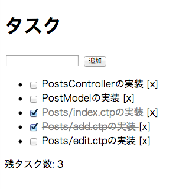

# Study Website HTML by dotinstall

## 概要
[Backbone.js入門 (全22回) - ドットインストール](http://dotinstall.com/lessons/basic_backbonejs)で勉強したときのログ。  

## 完成イメージ

## 制作するアプリケーションの機能
Model, View, Collection の使い方を学びつつ、以下の機能を実装していく

- タスクの表示
- タスクの追加
- Validation
- タスクの削除
- タスクの完了
- 残タスク数の表示

## 感想
かなり駆け足で学ぶことになるので、事前知識がないのであれば、一つ一つの処理にコメントを付ける等して、自身で捕捉をしていく必要があるかな。

2013年7月2日
